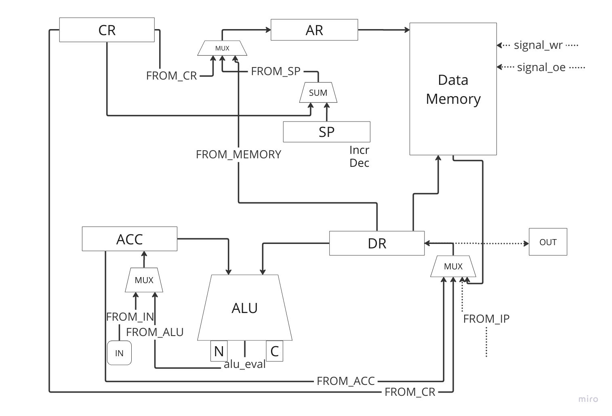

# Лабораторная работа №3. Транслятор и модель процессора

- P33111. Кузьмин Илья Дмитриевич
- lisp | acc | harv | hw | instr | struct | stream | port | pstr | prob5 | 8bit (Базовый вариант)
- без усложнения

## Язык программирования
За основу языка взят диалект Common Lisp

### Syntax
```
program: expression+

?expression : atomic
           | if_expression
           | function
           | invoke

atomic : name
       | integer
       | string


function : "(" "defun" name "(" params ")" body ")"
params : name*
body : expression

invoke : "(" invokable args ")"
!invokable : "="
    | "+"
    | "-"
    | "*"
    | "/"
    | "%"
    | ">"
    | "<"
    | "set"
    | "read"
    | "print"
    | name
args : expression*

if_expression : "(" "if" condition if_body else_body? ")"
condition : expression
if_body : expression
else_body : expression

name : NAME
integer : DEC_NUMBER
string : STRING

%import python (NAME, STRING, DEC_NUMBER)
%import common (WS)
%ignore WS
```
### Описание
- Все переменные глобальные
- Типы данных: uint, str
- Виды литералов:
  - Неотрицательные целочисленные: 123, 112358 (до 32 бит)
  - Строки: "abc", "qwerty"
- Поддержка математических операций (+, -, *, //, %)
- Код выполняется последовательно
- В стеке хранятся промежуточные аргументы и IP

## Организация памяти
- Гарвардская архитектура: память данных и команд разделены

```
Регистры
+------------------------------------+
| ACC - аккумулятор                  |
+------------------------------------+
| CR - регистр инструкции            |
+------------------------------------+
| DR - регистр данных                |
+------------------------------------+
| IP - счётчик команд                |
+------------------------------------+
| SP - указатель стека               |
+------------------------------------+
| AR - адрес записи в память         |
+------------------------------------+

Instruction memory
+------------------------------+
| 00  : program start          |
|    ...                       |
| 10  : jmp n                  |
| 11  : je n+1                 |
|    ...                       |
| n   :                        |
|    ... halt                  |
+------------------------------+

Data memory
+------------------------------+
| 00  : temp for ops           |
| 01  : vars                   |
|    ...                       |
| l+0 : const strings          |
|    ...                       |
| c+0 : dynamic data           |
|    ...                       |
|------------------------------|
| stack                        |
+------------------------------+
```

## Система команд

### Особенности процессора
- Машинное слово 32 бита, беззнаковое
- Поток управления:
  - Инкремент IP после каждой инструкции
  - Условные и безусловные переходы
- Поддерживается 4 вида адресации
  - Прямая загрузка значения
  - Прямая адресация
  - Косвенная адресация
  - Адресация относительно SP

### Набор инструкций

| Opcode | arg                | Описание                               |
|--------|--------------------|----------------------------------------|
| load   | addr/literal       | data_mem[addr]/literal -> acc          |
| store  | addr               | acc -> data_mem[addr]                  |
| push   |                    | acc -> stack[SP--]                     |
| pop    |                    | SP++                                   |
| call   | addr               | stack[SP--] <- IP                      |
| ret    | addr               | stack[SP--] <- IP                      |
|        |                    |                                        |
| add    | addr/immediate/sp/ | acc + data_mem[addr]/literal -> acc    |
| sub    | addr/literal       | acc - data_mem[addr]/literal -> acc    |
| mul    | addr/literal       | acc * data_mem[addr]/literal -> acc    |
| div    | addr/literal       | acc // data_mem[addr]/literal -> acc   |
| mod    | addr/literal       | acc % data_mem[addr]/literal -> acc    |
|        |                    |                                        |
| cmp    | addr/literal       | acc - data_mem[addr]/literal -> ZF, CF |
| jmp    | addr               | addr -> IP                             |
| je     | addr               | Z == 1 ? addr -> IP                    |
| jne    | addr               | Z == 0 ? addr -> IP                    |
| jb     | addr               | C == 1 ? addr -> IP                    |
| ja     | addr               | C == 0 && Z == 0 ? addr -> IP          |

## Транслятор

Интерфейс CLI: `make translator ARGS="input_file output_file"`
В выходном файле содержится json с заполнением instruction_memory и data_memory

Реализация в модуле [translator](./src/translator)

Этапы трансляции:
1. Построение AST с помощью библиотеки [lark](https://github.com/lark-parser/lark) по eBNF
2. Трансляция - обход нод AST и преобразование в машинный код
3. Повторный проход по командам и линковка переменных/строк после их размещения в памяти

## Модель процессора

Интерфейс CLI: `make machine ARGS="code_data_file input_file"`

Реализация в модуле [machine](./src/machine)

Datapath:


Control Unit:


## Тестирование

Реализованные программы:

1. [hello](./examples/hello.lisp): печать "Hello world!"
2. [cat](./examples/cat.lisp): программа cat, ввод -> вывод
3. [hello_user_name](./examples/hello_user_name.lisp): запросить у пользователя его имя, считать его, вывести на экран приветствие
4. [prob5](./examples/prob5.lisp): вычисление наименьшего положительного числа, делящегося на все числа от 1 до 20

Golden тесты реализованы в [golden](./golden), конфигурация в [golden_test.py](./tests/golden_test.py)

CI при помощи Github Action:

```yaml
name: Checks

on: [push, pull_request]

jobs:
  quality:
    name: Nothing has broken
    runs-on: ubuntu-latest

    steps:
      - name: Check out the code
        uses: actions/checkout@v3

      - name: Set up Python 3.11
        uses: actions/setup-python@v3
        with:
          python-version: "3.11"

      - name: Install poetry
        run: python -m pip install poetry

      - name: Install dependencies
        run: poetry install

      - name: Lint with ruff
        run: make lint

      - name: Run tests and show coverage
        run: make coverage
```

Пример использования и журнал работы процессора на примере `hello_world`

- Код:
(print "Hello world!")

- Машинный код:
```
[{"index": 0, "opcode": "jmp", "addressing_mode": "direct", "arg": 1},
   {"index": 1, "opcode": "load", "addressing_mode": "immediate", "arg": 3},
   {"index": 2, "opcode": "add", "addressing_mode": "immediate", "arg": 1},
   {"index": 3, "opcode": "store", "addressing_mode": "direct", "arg": 0},
   {"index": 4, "opcode": "out", "addressing_mode": "indirect", "arg": 0},
   {"index": 5, "opcode": "load", "addressing_mode": "direct", "arg": 0},
   {"index": 6, "opcode": "add", "addressing_mode": "immediate", "arg": 1},
   {"index": 7, "opcode": "store", "addressing_mode": "direct", "arg": 0},
   {"index": 8, "opcode": "load", "addressing_mode": "direct", "arg": 3},
   {"index": 9, "opcode": "cmp", "addressing_mode": "immediate", "arg": 1},
   {"index": 10, "opcode": "je", "addressing_mode": "direct", "arg": 14},
   {"index": 11, "opcode": "sub", "addressing_mode": "immediate", "arg": 1},
   {"index": 12, "opcode": "store", "addressing_mode": "direct", "arg": 3},
   {"index": 13, "opcode": "jmp", "addressing_mode": "direct", "arg": 4},
   {"index": 14, "opcode": "halt", "addressing_mode": "direct", "arg": 0}]
```

- Вывод программы:
Hello world!

- Журнал работы:
``` 
DEBUG   main:emulate       Instr:   0 Ticks:    0 IP:   0 Acc:          0 AR:    0 DR:    0 SP:  499
  DEBUG   main:emulate       Instr:   1 Ticks:    3 IP:   1 Acc:          0 AR:    1 DR:    0 SP:  499
  DEBUG   main:emulate       Instr:   2 Ticks:    5 IP:   2 Acc:          3 AR:    1 DR:    3 SP:  499
  DEBUG   main:emulate       Instr:   3 Ticks:    7 IP:   3 Acc:          4 AR:    1 DR:    1 SP:  499
  DEBUG   main:emulate       Instr:   4 Ticks:    9 IP:   4 Acc:          4 AR:    0 DR:    4 SP:  499
  DEBUG   main:emulate       Instr:   5 Ticks:   13 IP:   5 Acc:          4 AR:    4 DR:   72 SP:  499
  DEBUG   main:emulate       Instr:   6 Ticks:   16 IP:   6 Acc:          4 AR:    0 DR:    4 SP:  499
  DEBUG   main:emulate       Instr:   7 Ticks:   18 IP:   7 Acc:          5 AR:    0 DR:    1 SP:  499
  DEBUG   main:emulate       Instr:   8 Ticks:   20 IP:   8 Acc:          5 AR:    0 DR:    5 SP:  499
  DEBUG   main:emulate       Instr:   9 Ticks:   23 IP:   9 Acc:         12 AR:    3 DR:   12 SP:  499
  DEBUG   main:emulate       Instr:  10 Ticks:   25 IP:  10 Acc:         12 AR:    3 DR:    1 SP:  499
  DEBUG   main:emulate       Instr:  11 Ticks:   28 IP:  11 Acc:         12 AR:   14 DR:  100 SP:  499
  DEBUG   main:emulate       Instr:  12 Ticks:   30 IP:  12 Acc:         11 AR:   14 DR:    1 SP:  499
  DEBUG   main:emulate       Instr:  13 Ticks:   32 IP:  13 Acc:         11 AR:    3 DR:   11 SP:  499
  DEBUG   main:emulate       Instr:  14 Ticks:   35 IP:   4 Acc:         11 AR:    4 DR:   72 SP:  499
  DEBUG   main:emulate       Instr:  15 Ticks:   39 IP:   5 Acc:         11 AR:    5 DR:  101 SP:  499
  DEBUG   main:emulate       Instr:  16 Ticks:   42 IP:   6 Acc:          5 AR:    0 DR:    5 SP:  499
  DEBUG   main:emulate       Instr:  17 Ticks:   44 IP:   7 Acc:          6 AR:    0 DR:    1 SP:  499
  DEBUG   main:emulate       Instr:  18 Ticks:   46 IP:   8 Acc:          6 AR:    0 DR:    6 SP:  499
  DEBUG   main:emulate       Instr:  19 Ticks:   49 IP:   9 Acc:         11 AR:    3 DR:   11 SP:  499
  DEBUG   main:emulate       Instr:  20 Ticks:   51 IP:  10 Acc:         11 AR:    3 DR:    1 SP:  499
  DEBUG   main:emulate       Instr:  21 Ticks:   54 IP:  11 Acc:         11 AR:   14 DR:  100 SP:  499
  DEBUG   main:emulate       Instr:  22 Ticks:   56 IP:  12 Acc:         10 AR:   14 DR:    1 SP:  499
  DEBUG   main:emulate       Instr:  23 Ticks:   58 IP:  13 Acc:         10 AR:    3 DR:   10 SP:  499
  DEBUG   main:emulate       Instr:  24 Ticks:   61 IP:   4 Acc:         10 AR:    4 DR:   72 SP:  499
  DEBUG   main:emulate       Instr:  25 Ticks:   65 IP:   5 Acc:         10 AR:    6 DR:  108 SP:  499
  DEBUG   main:emulate       Instr:  26 Ticks:   68 IP:   6 Acc:          6 AR:    0 DR:    6 SP:  499
  DEBUG   main:emulate       Instr:  27 Ticks:   70 IP:   7 Acc:          7 AR:    0 DR:    1 SP:  499
  DEBUG   main:emulate       Instr:  28 Ticks:   72 IP:   8 Acc:          7 AR:    0 DR:    7 SP:  499
  DEBUG   main:emulate       Instr:  29 Ticks:   75 IP:   9 Acc:         10 AR:    3 DR:   10 SP:  499
  DEBUG   main:emulate       Instr:  30 Ticks:   77 IP:  10 Acc:         10 AR:    3 DR:    1 SP:  499
  DEBUG   main:emulate       Instr:  31 Ticks:   80 IP:  11 Acc:         10 AR:   14 DR:  100 SP:  499
  DEBUG   main:emulate       Instr:  32 Ticks:   82 IP:  12 Acc:          9 AR:   14 DR:    1 SP:  499
  DEBUG   main:emulate       Instr:  33 Ticks:   84 IP:  13 Acc:          9 AR:    3 DR:    9 SP:  499
  DEBUG   main:emulate       Instr:  34 Ticks:   87 IP:   4 Acc:          9 AR:    4 DR:   72 SP:  499
  DEBUG   main:emulate       Instr:  35 Ticks:   91 IP:   5 Acc:          9 AR:    7 DR:  108 SP:  499
  DEBUG   main:emulate       Instr:  36 Ticks:   94 IP:   6 Acc:          7 AR:    0 DR:    7 SP:  499
  DEBUG   main:emulate       Instr:  37 Ticks:   96 IP:   7 Acc:          8 AR:    0 DR:    1 SP:  499
  DEBUG   main:emulate       Instr:  38 Ticks:   98 IP:   8 Acc:          8 AR:    0 DR:    8 SP:  499
  DEBUG   main:emulate       Instr:  39 Ticks:  101 IP:   9 Acc:          9 AR:    3 DR:    9 SP:  499
  DEBUG   main:emulate       Instr:  40 Ticks:  103 IP:  10 Acc:          9 AR:    3 DR:    1 SP:  499
  DEBUG   main:emulate       Instr:  41 Ticks:  106 IP:  11 Acc:          9 AR:   14 DR:  100 SP:  499
  DEBUG   main:emulate       Instr:  42 Ticks:  108 IP:  12 Acc:          8 AR:   14 DR:    1 SP:  499
  DEBUG   main:emulate       Instr:  43 Ticks:  110 IP:  13 Acc:          8 AR:    3 DR:    8 SP:  499
  DEBUG   main:emulate       Instr:  44 Ticks:  113 IP:   4 Acc:          8 AR:    4 DR:   72 SP:  499
  DEBUG   main:emulate       Instr:  45 Ticks:  117 IP:   5 Acc:          8 AR:    8 DR:  111 SP:  499
  DEBUG   main:emulate       Instr:  46 Ticks:  120 IP:   6 Acc:          8 AR:    0 DR:    8 SP:  499
  DEBUG   main:emulate       Instr:  47 Ticks:  122 IP:   7 Acc:          9 AR:    0 DR:    1 SP:  499
  DEBUG   main:emulate       Instr:  48 Ticks:  124 IP:   8 Acc:          9 AR:    0 DR:    9 SP:  499
  DEBUG   main:emulate       Instr:  49 Ticks:  127 IP:   9 Acc:          8 AR:    3 DR:    8 SP:  499
  DEBUG   main:emulate       Instr:  50 Ticks:  129 IP:  10 Acc:          8 AR:    3 DR:    1 SP:  499
  DEBUG   main:emulate       Instr:  51 Ticks:  132 IP:  11 Acc:          8 AR:   14 DR:  100 SP:  499
  DEBUG   main:emulate       Instr:  52 Ticks:  134 IP:  12 Acc:          7 AR:   14 DR:    1 SP:  499
  DEBUG   main:emulate       Instr:  53 Ticks:  136 IP:  13 Acc:          7 AR:    3 DR:    7 SP:  499
  DEBUG   main:emulate       Instr:  54 Ticks:  139 IP:   4 Acc:          7 AR:    4 DR:   72 SP:  499
  DEBUG   main:emulate       Instr:  55 Ticks:  143 IP:   5 Acc:          7 AR:    9 DR:   32 SP:  499
  DEBUG   main:emulate       Instr:  56 Ticks:  146 IP:   6 Acc:          9 AR:    0 DR:    9 SP:  499
  DEBUG   main:emulate       Instr:  57 Ticks:  148 IP:   7 Acc:         10 AR:    0 DR:    1 SP:  499
  DEBUG   main:emulate       Instr:  58 Ticks:  150 IP:   8 Acc:         10 AR:    0 DR:   10 SP:  499
  DEBUG   main:emulate       Instr:  59 Ticks:  153 IP:   9 Acc:          7 AR:    3 DR:    7 SP:  499
  DEBUG   main:emulate       Instr:  60 Ticks:  155 IP:  10 Acc:          7 AR:    3 DR:    1 SP:  499
  DEBUG   main:emulate       Instr:  61 Ticks:  158 IP:  11 Acc:          7 AR:   14 DR:  100 SP:  499
  DEBUG   main:emulate       Instr:  62 Ticks:  160 IP:  12 Acc:          6 AR:   14 DR:    1 SP:  499
  DEBUG   main:emulate       Instr:  63 Ticks:  162 IP:  13 Acc:          6 AR:    3 DR:    6 SP:  499
  DEBUG   main:emulate       Instr:  64 Ticks:  165 IP:   4 Acc:          6 AR:    4 DR:   72 SP:  499
  DEBUG   main:emulate       Instr:  65 Ticks:  169 IP:   5 Acc:          6 AR:   10 DR:  119 SP:  499
  DEBUG   main:emulate       Instr:  66 Ticks:  172 IP:   6 Acc:         10 AR:    0 DR:   10 SP:  499
  DEBUG   main:emulate       Instr:  67 Ticks:  174 IP:   7 Acc:         11 AR:    0 DR:    1 SP:  499
  DEBUG   main:emulate       Instr:  68 Ticks:  176 IP:   8 Acc:         11 AR:    0 DR:   11 SP:  499
  DEBUG   main:emulate       Instr:  69 Ticks:  179 IP:   9 Acc:          6 AR:    3 DR:    6 SP:  499
  DEBUG   main:emulate       Instr:  70 Ticks:  181 IP:  10 Acc:          6 AR:    3 DR:    1 SP:  499
  DEBUG   main:emulate       Instr:  71 Ticks:  184 IP:  11 Acc:          6 AR:   14 DR:  100 SP:  499
  DEBUG   main:emulate       Instr:  72 Ticks:  186 IP:  12 Acc:          5 AR:   14 DR:    1 SP:  499
  DEBUG   main:emulate       Instr:  73 Ticks:  188 IP:  13 Acc:          5 AR:    3 DR:    5 SP:  499
  DEBUG   main:emulate       Instr:  74 Ticks:  191 IP:   4 Acc:          5 AR:    4 DR:   72 SP:  499
  DEBUG   main:emulate       Instr:  75 Ticks:  195 IP:   5 Acc:          5 AR:   11 DR:  111 SP:  499
  DEBUG   main:emulate       Instr:  76 Ticks:  198 IP:   6 Acc:         11 AR:    0 DR:   11 SP:  499
  DEBUG   main:emulate       Instr:  77 Ticks:  200 IP:   7 Acc:         12 AR:    0 DR:    1 SP:  499
  DEBUG   main:emulate       Instr:  78 Ticks:  202 IP:   8 Acc:         12 AR:    0 DR:   12 SP:  499
  DEBUG   main:emulate       Instr:  79 Ticks:  205 IP:   9 Acc:          5 AR:    3 DR:    5 SP:  499
  DEBUG   main:emulate       Instr:  80 Ticks:  207 IP:  10 Acc:          5 AR:    3 DR:    1 SP:  499
  DEBUG   main:emulate       Instr:  81 Ticks:  210 IP:  11 Acc:          5 AR:   14 DR:  100 SP:  499
  DEBUG   main:emulate       Instr:  82 Ticks:  212 IP:  12 Acc:          4 AR:   14 DR:    1 SP:  499
  DEBUG   main:emulate       Instr:  83 Ticks:  214 IP:  13 Acc:          4 AR:    3 DR:    4 SP:  499
  DEBUG   main:emulate       Instr:  84 Ticks:  217 IP:   4 Acc:          4 AR:    4 DR:   72 SP:  499
  DEBUG   main:emulate       Instr:  85 Ticks:  221 IP:   5 Acc:          4 AR:   12 DR:  114 SP:  499
  DEBUG   main:emulate       Instr:  86 Ticks:  224 IP:   6 Acc:         12 AR:    0 DR:   12 SP:  499
  DEBUG   main:emulate       Instr:  87 Ticks:  226 IP:   7 Acc:         13 AR:    0 DR:    1 SP:  499
  DEBUG   main:emulate       Instr:  88 Ticks:  228 IP:   8 Acc:         13 AR:    0 DR:   13 SP:  499
  DEBUG   main:emulate       Instr:  89 Ticks:  231 IP:   9 Acc:          4 AR:    3 DR:    4 SP:  499
  DEBUG   main:emulate       Instr:  90 Ticks:  233 IP:  10 Acc:          4 AR:    3 DR:    1 SP:  499
  DEBUG   main:emulate       Instr:  91 Ticks:  236 IP:  11 Acc:          4 AR:   14 DR:  100 SP:  499
  DEBUG   main:emulate       Instr:  92 Ticks:  238 IP:  12 Acc:          3 AR:   14 DR:    1 SP:  499
  DEBUG   main:emulate       Instr:  93 Ticks:  240 IP:  13 Acc:          3 AR:    3 DR:    3 SP:  499
  DEBUG   main:emulate       Instr:  94 Ticks:  243 IP:   4 Acc:          3 AR:    4 DR:   72 SP:  499
  DEBUG   main:emulate       Instr:  95 Ticks:  247 IP:   5 Acc:          3 AR:   13 DR:  108 SP:  499
  DEBUG   main:emulate       Instr:  96 Ticks:  250 IP:   6 Acc:         13 AR:    0 DR:   13 SP:  499
  DEBUG   main:emulate       Instr:  97 Ticks:  252 IP:   7 Acc:         14 AR:    0 DR:    1 SP:  499
  DEBUG   main:emulate       Instr:  98 Ticks:  254 IP:   8 Acc:         14 AR:    0 DR:   14 SP:  499
  DEBUG   main:emulate       Instr:  99 Ticks:  257 IP:   9 Acc:          3 AR:    3 DR:    3 SP:  499
  DEBUG   main:emulate       Instr: 100 Ticks:  259 IP:  10 Acc:          3 AR:    3 DR:    1 SP:  499
  DEBUG   main:emulate       Instr: 101 Ticks:  262 IP:  11 Acc:          3 AR:   14 DR:  100 SP:  499
  DEBUG   main:emulate       Instr: 102 Ticks:  264 IP:  12 Acc:          2 AR:   14 DR:    1 SP:  499
  DEBUG   main:emulate       Instr: 103 Ticks:  266 IP:  13 Acc:          2 AR:    3 DR:    2 SP:  499
  DEBUG   main:emulate       Instr: 104 Ticks:  269 IP:   4 Acc:          2 AR:    4 DR:   72 SP:  499
  DEBUG   main:emulate       Instr: 105 Ticks:  273 IP:   5 Acc:          2 AR:   14 DR:  100 SP:  499
  DEBUG   main:emulate       Instr: 106 Ticks:  276 IP:   6 Acc:         14 AR:    0 DR:   14 SP:  499
  DEBUG   main:emulate       Instr: 107 Ticks:  278 IP:   7 Acc:         15 AR:    0 DR:    1 SP:  499
  DEBUG   main:emulate       Instr: 108 Ticks:  280 IP:   8 Acc:         15 AR:    0 DR:   15 SP:  499
  DEBUG   main:emulate       Instr: 109 Ticks:  283 IP:   9 Acc:          2 AR:    3 DR:    2 SP:  499
  DEBUG   main:emulate       Instr: 110 Ticks:  285 IP:  10 Acc:          2 AR:    3 DR:    1 SP:  499
  DEBUG   main:emulate       Instr: 111 Ticks:  288 IP:  11 Acc:          2 AR:   14 DR:  100 SP:  499
  DEBUG   main:emulate       Instr: 112 Ticks:  290 IP:  12 Acc:          1 AR:   14 DR:    1 SP:  499
  DEBUG   main:emulate       Instr: 113 Ticks:  292 IP:  13 Acc:          1 AR:    3 DR:    1 SP:  499
  DEBUG   main:emulate       Instr: 114 Ticks:  295 IP:   4 Acc:          1 AR:    4 DR:   72 SP:  499
  DEBUG   main:emulate       Instr: 115 Ticks:  299 IP:   5 Acc:          1 AR:   15 DR:   33 SP:  499
  DEBUG   main:emulate       Instr: 116 Ticks:  302 IP:   6 Acc:         15 AR:    0 DR:   15 SP:  499
  DEBUG   main:emulate       Instr: 117 Ticks:  304 IP:   7 Acc:         16 AR:    0 DR:    1 SP:  499
  DEBUG   main:emulate       Instr: 118 Ticks:  306 IP:   8 Acc:         16 AR:    0 DR:   16 SP:  499
  DEBUG   main:emulate       Instr: 119 Ticks:  309 IP:   9 Acc:          1 AR:    3 DR:    1 SP:  499
  DEBUG   main:emulate       Instr: 120 Ticks:  311 IP:  10 Acc:          1 AR:    3 DR:    1 SP:  499
  DEBUG   main:emulate       Instr: 121 Ticks:  314 IP:  14 Acc:          1 AR:   14 DR:  100 SP:  499
```

## Статистика
| ФИО                     | алг             | LoC | code байт | code инстр. | инстр. | такт. | вариант                                              |
|-------------------------|-----------------|-----|-----------|-------------|--------|-------|------------------------------------------------------|
| Кузьмин Илья Дмитриевич | hello           | 1   | -         | 6           | 15     | 28    | lisp acc harv hw instr struct stream port pstr prob5 |
| Кузьмин Илья Дмитриевич | cat             | 1   | -         | 6           | 15     | 28    | lisp acc harv hw instr struct stream port pstr prob5 |
| Кузьмин Илья Дмитриевич | hello_user_name | 4   | -         | 6           | 15     | 28    | lisp acc harv hw instr struct stream port pstr prob5 |
| Кузьмин Илья Дмитриевич | prob5           | 11  | -         | 70          | 2086   | 28    | lisp acc harv hw instr struct stream port pstr prob5 |
